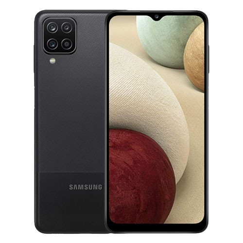

#  android_samsung_a12_kernel
The Samsung A12s (codename _"a12s"_) have following parameters:



# Build
1. clone repo
```
git clone https://github.com/foxiyofox/A12s-nacho-Bit_14.git
```
2. clone toolchain
```
git clone https://github.com/foxiyofox/toolchain_clang-r383902_gcc4.9.git
```
3. build kernel (output path = `out/arch/arm64/boot/Image`)
```
bash build_kernel.sh
```
